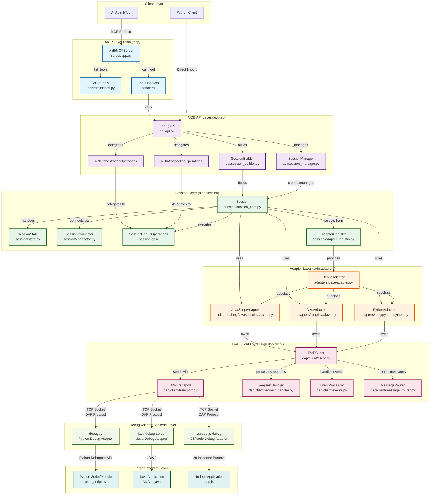

# AI Debugger — Developer Overview

This repository provides a lightweight, language-agnostic Python API that lets
AI systems programmatically control and introspect live debugging sessions. By
mirroring familiar human debugging workflows (set/verify breakpoints, step,
inspect variables/stack, evaluate expressions), it enables building
self-correcting, reasoning-capable agents and intelligent developer tools. The
project is designed to be minimal in dependencies and portable across macOS,
Linux, and WSL.

## Architecture (at a glance)

The system centers around the Debug Adapter Protocol (DAP) and a session
orchestration layer that abstracts language/runtime specifics via pluggable
adapters.

### Detailed System Architecture

The following diagram illustrates the complete data flow from AI agents through the MCP layer, down to the debug adapter backends and target programs:

**Key Architecture Components:**

1. **MCP Layer** (`aidb_mcp/`): Exposes AIDB capabilities via Model Context Protocol

   - `AidbMCPServer`: Main MCP server handling tool calls
   - Tool definitions and handlers bridge MCP to AIDB API

1. **AIDB API Layer** (`aidb/api/`): High-level Python API for debugging operations

   - `DebugAPI`: Main entry point with introspection/orchestration operations
   - `SessionManager`: Manages session lifecycle and registry
   - `SessionBuilder`: Constructs sessions with proper configuration

1. **Session Layer** (`aidb/session/`): Core session orchestration and state management

   - `Session`: Central orchestrator coordinating adapters and DAP clients
   - `SessionConnector`: Manages DAP connection lifecycle
   - `SessionDebugOperations`: Executes debug operations (breakpoints, stepping, evaluation)

1. **Adapter Layer** (`aidb/adapters/`): Language-specific debug adapter implementations

   - `PythonAdapter`: Launches/attaches debugpy, manages Python-specific configuration
   - `JavaAdapter`: Launches/attaches java-debug-server with JDWP
   - `JavaScriptAdapter`: Launches/attaches Node.js debug adapter

1. **DAP Client Layer** (`aidb/dap/client/`): Debug Adapter Protocol client implementation

   - `DAPClient`: Single request path for all DAP operations
   - `DAPTransport`: TCP socket communication with debug adapters
   - `EventProcessor`: Handles DAP events (stopped, breakpoint, output, etc.)
   - `RequestHandler`: Manages request/response lifecycle with futures

1. **Debug Adapter Backend Layer**: Language-specific debug servers (external)

   - `debugpy`: Microsoft's Python debug adapter implementing DAP
   - `java-debug-server`: Java debug adapter using JDWP
   - `node-debug2`: Node.js/JavaScript debug adapter using V8 Inspector Protocol

1. **Target Program Layer**: The actual programs being debugged

   - User's Python scripts, Java applications, or Node.js programs

**Data Flow Example (Setting a Breakpoint):**

1. AI Agent → MCP Server: `call_tool("debug_set_breakpoint")`
1. MCP Handler → DebugAPI: `api.orchestration.set_breakpoint()`
1. DebugAPI → Session: `session.set_breakpoint()`
1. Session → Adapter: `adapter.verify_breakpoint_location()`
1. Adapter → DAPClient: `dap_client.send_request(SetBreakpointsRequest)`
1. DAPClient → Transport: Serialize and send over TCP socket
1. Transport → debugpy: DAP protocol message
1. debugpy → Python Debuggee: Set actual breakpoint in interpreter
1. Response flows back up the stack with breakpoint verification

High-level flow:

- An agent/tool or Python client uses the AIDB API to create/manage sessions.
- A session selects a language adapter that knows how to launch/attach to the
  target program and speak DAP to its debug adapter (e.g., `debugpy` for
  Python).
- The DAP client manages requests/events and exposes a typed, ergonomic
  interface for stepping, breakpoints, inspection, and execution.
- Optional integration layers expose AIDB capabilities to non-Python clients
  (via MCP).
- A shared logging layer provides consistent, structured observability across
  all components.

Key packages (code roots under `src/`):

- `src/aidb/` — Core library: DAP protocol implementations, session
  orchestration, language adapters, high-level Python API.
- `src/aidb_mcp/` — MCP server and tools exposing AIDB capabilities over Model
  Context Protocol; CLI entrypoint `aidb-mcp`.
- `src/aidb_logging/` — Structured logging utilities and configuration used
  across components.

## Key Source Locations

| Package | Purpose |
|---------|---------|
| `src/aidb/` | Core library: DAP protocol, session orchestration, language adapters |
| `src/aidb/api/` | High-level Python API |
| `src/aidb/session/` | Session management and state |
| `src/aidb/adapters/` | Language-specific adapters (Python, JavaScript, Java) |
| `src/aidb/dap/` | DAP protocol client implementation |
| `src/aidb_mcp/` | MCP server exposing debugging tools |
| `src/aidb_cli/` | Developer CLI |
| `src/aidb_common/` | Shared utilities |
| `src/aidb_logging/` | Structured logging |
