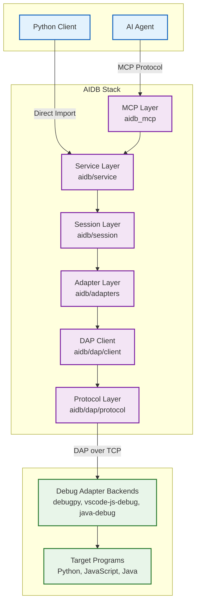

# AI Debugger — Developer Overview

This repository provides a lightweight, language-agnostic Python API that lets
AI systems programmatically control and introspect live debugging sessions. By
mirroring familiar human debugging workflows (set/verify breakpoints, step,
inspect variables/stack, evaluate expressions), it enables building
self-correcting, reasoning-capable agents and intelligent developer tools. The
project is designed to be minimal in dependencies and portable across macOS,
Linux, and WSL.

## Architecture (at a glance)

The system centers around the Debug Adapter Protocol (DAP) and a session
orchestration layer that abstracts language/runtime specifics via pluggable
adapters.

### System Architecture

The following diagram illustrates the layered architecture from AI agents through the
MCP layer, down to debug adapter backends and target programs:

**Key Architecture Components:**

1. **MCP Layer** (`aidb_mcp/`): Exposes AIDB capabilities via Model Context Protocol

   - `AidbMCPServer` (`server/app.py`): Main MCP server handling tool calls
   - `ToolRegistry` (`registry.py`): Central registry for handler management
   - `get_all_mcp_tools()` (`tools/definitions.py`): Tool definitions function
   - Domain-based handlers: `handlers/` organized by functionality

2. **Service Layer** (`aidb/service/`): High-level Python API for debugging operations

   - `DebugService` (`debug_service.py`): Main entry point aggregating all services
   - `ExecutionControl` (`execution/control.py`): Continue, pause, restart, stop operations
   - `SteppingService` (`execution/stepping.py`): Step into/over/out/back operations
   - `BreakpointService` (`breakpoints/manager.py`): Breakpoint management
   - `VariableService` (`variables/inspector.py`): Variable inspection and modification
   - `StackService` (`stack/navigator.py`): Call stack and thread navigation

3. **Session Layer** (`aidb/session/`): Core session orchestration and state management

   - `Session` (`session_core.py`): Central orchestrator coordinating adapters and DAP
   - `SessionState` (`state.py`): Manages session status and error state
   - `SessionConnector` (`connector.py`): Manages DAP connection lifecycle
   - `ResourceManager` (`resource.py`): Manages process and port registries
   - `SessionDebugOperations` (`ops/`): Executes debug operations via mixins
   - `SessionRegistry` (`registry.py`): Tracks active sessions with cleanup support

4. **Adapter Layer** (`aidb/adapters/`): Language-specific debug adapter implementations

   - `DebugAdapter` (`base/adapter.py`): Base class with component delegation
   - `ProcessManager` (`base/components/`): Manages adapter process lifecycle
   - `PortManager` (`base/components/`): Manages port allocation and release
   - `LaunchOrchestrator` (`base/components/`): Orchestrates launch sequence
   - `SourcePathResolver` (`base/source_path_resolver.py`): Resolves remote paths to local source
   - `TargetResolver` (`base/target_resolver.py`): Detects and normalizes target types
   - `PythonAdapter` (`lang/python/`): debugpy integration
   - `JavaScriptAdapter` (`lang/javascript/`): vscode-js-debug integration
   - `JavaAdapter` (`lang/java/`): java-debug integration

5. **DAP Client Layer** (`aidb/dap/client/`): Debug Adapter Protocol client implementation

   - `DAPClient` (`client.py`): Single request path for all DAP operations
   - `ConnectionManager` (`connection_manager.py`): Connection lifecycle management
   - `DAPTransport` (`transport.py`): TCP socket communication with debug adapters
   - `RequestHandler` (`request_handler.py`): Request/response lifecycle with futures
   - `EventProcessor` (`events.py`): Handles DAP events (stopped, breakpoint, etc.)
   - `MessageRouter` (`message_router.py`): Routes messages between components

6. **Protocol Layer** (`aidb/dap/protocol/`): Fully-typed DAP specification

   - `base.py`: `ProtocolMessage`, `Request`, `Response`, `Event` base classes
   - `types.py`: DAP type definitions
   - `requests.py`, `responses.py`, `events.py`, `bodies.py`: Complete DAP spec

7. **Debug Adapter Backends** (external): Language-specific debug servers

   - `debugpy`: Microsoft's Python debug adapter
   - `vscode-js-debug`: JavaScript/TypeScript debug adapter (V8 Inspector)
   - `java-debug`: Java debug adapter (JDWP)

8. **Target Programs**: The actual programs being debugged

   - Python scripts, Node.js applications, Java applications

**Data Flow Example (Setting a Breakpoint):**

1. AI Agent → MCP Server: `call_tool("debug_set_breakpoint")`
1. MCP Handler → DebugService: `service.breakpoints.set()`
1. DebugService → Session: `session.dap.send_request(SetBreakpointsRequest)`
1. Session → Adapter: `adapter.verify_breakpoint_location()`
1. Adapter → DAPClient: `dap_client.send_request(SetBreakpointsRequest)`
1. DAPClient → Transport: Serialize and send over TCP socket
1. Transport → debugpy: DAP protocol message
1. debugpy → Python Debuggee: Set actual breakpoint in interpreter
1. Response flows back up the stack with breakpoint verification

High-level flow:

- An agent/tool or Python client uses the AIDB API to create/manage sessions.
- A session selects a language adapter that knows how to launch/attach to the
  target program and speak DAP to its debug adapter (e.g., `debugpy` for
  Python).
- The DAP client manages requests/events and exposes a typed, ergonomic
  interface for stepping, breakpoints, inspection, and execution.
- Optional integration layers expose AIDB capabilities to non-Python clients
  (via MCP).
- A shared logging layer provides consistent, structured observability across
  all components.

Key packages (code roots under `src/`):

- `src/aidb/` — Core library: DAP protocol implementations, session
  orchestration, language adapters, high-level Python API.
- `src/aidb_mcp/` — MCP server and tools exposing AIDB capabilities over Model
  Context Protocol; CLI entrypoint `aidb-mcp`.
- `src/aidb_logging/` — Structured logging utilities and configuration used
  across components.

## Key Source Locations

| Package | Purpose |
|---------|---------|
| `src/aidb/` | Core library: DAP protocol, session orchestration, language adapters |
| `src/aidb/service/` | High-level Python API (DebugService, ExecutionControl, etc.) |
| `src/aidb/session/` | Session management, state, and lifecycle |
| `src/aidb/adapters/` | Language-specific adapters (Python, JavaScript, Java) |
| `src/aidb/dap/` | DAP protocol client implementation |
| `src/aidb_mcp/` | MCP server exposing debugging tools |
| `src/aidb_cli/` | Developer CLI |
| `src/aidb_common/` | Shared utilities |
| `src/aidb_logging/` | Structured logging |
